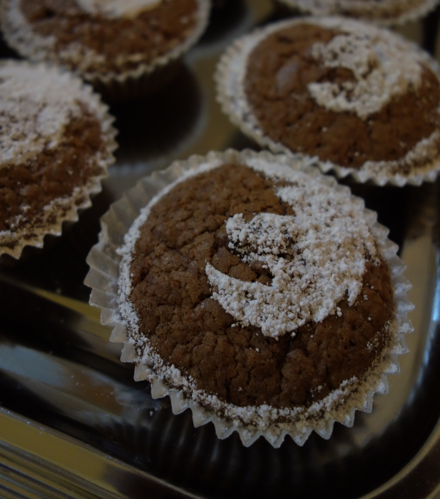

extends: default.liquid

title: The Berlin Mozilla Tech Weekend 2015 Day 1
date: 06 December 2015 12:00:00 +0100
---
We, the Berlin Mozilla Community, hosted the [Mozilla Tech
Weekend](http://www.meetup.com/Berlin-Mozilla-Meetup/events/226461969/) on
November 28th and 29th. This was the first event organized by our young
community with many more to come. I just want to give a quick recap of what
happened there in case you missed it, you want to catch up on some links or
refresh your memory.

On Saturday, 28th of November we started off with the tech talk part of the
weekend. We opened the doors at 11 a.m. and welcomed our fellow mozillians
with hot coffee and some delicious Firefox cupcakes (thanks
[@manumiu](https://twitter.com/manumiu)):

After everyone found themselves a chair I
([@fiji_flo](http://twitter.com/fiji_flo)) started with my talk: [Mozilla: A
brief
Introduction](http://static.fiji-flo.de/mozilla-intro-slides/mozilla-intro.html).
I talked a little bit about Mozilla in general, especially that depending on
the audience it's can be  very important to not just refer to Mozilla like
everyone knows who we are. Just try to casually mention that we are the
folks behind Firefox (the browser) and Mozilla is this nice non-profit
organization with a great community. I think the main message of my talks
was: [**WE ALL** are Mozilla](http://blog.fiji-flo.de/mymozfest2015/), along
with some details on the agenda for the Mozilla Berlin Community in 2016.

Up Next was Michael Henretty ([@mikehenrty](https://twitter.com/mikehenrty))
with his talk titled: [Firefox OS: Why we
exist](https://mikehenrty.github.io/talk-fxos/). Michael talked about the
beginning of Firefox OS and why and where it is heading. Take a look at his
awesome [slides](https://mikehenrty.github.io/talk-fxos/)!

We took a short break to get some more coffee into our systems and started
to chat a little. People were still arriving, probably due to the fact that
it had actually started to snow this morning which is not the most
motivating thing that could happen on a Saturday morning. Claas Augner did a
great job at our nice little welcome desk:

Our third talk was *Servo: Mozilla's Parallel & Safe Next-Generation Browser
Engine* by Till Schneidereit
([@tschneidereit](https://twitter.com/tschneidereit)). He also talked a lot
about [Rust](https://www.rust-lang.org/) and did a good job advertising his
workshop on Rust/Servo on Sunday. We had some nice discussions during and
after this talk, e.g. about how Rust can improve the security of a browser
engine.

The last talk before Lunch was held by Georg Fritzsche
([@GeorgFritzsche](https://twitter.com/GeorgFritzsche)) about: *Data
reporting at Mozilla*. He explained how Mozilla collects data, how users can
opt in or opt out, and how the privacy can be maintained doing this. Take a
look at the [Telemetry Dashboards](https://telemetry.mozilla.org/) if you
like to dig a little deeper.

**Lunch time!** Some pizza and finally enough time to mingle. I got to know
nice new people, some of them even came from Munich or Bremen. We talked a
lot about Mozilla in Berlin, what we can do and how to grow a healthy
community.

Last talk of the day: Stefania Delprete
([@physte3](https://twitter.com/physte3)) told us *What's new in Firefox*.
She introduced some of the features which came in Firefox 42 (the current
stable version) and Firefox 44 (the current version of [Firefox Developer
Edition](http://mozilla.org/firefox/developer)). One of the most awesome
features are the new visual animation debugging tools and their incredible
[introduction page](http://devtoolschallenger.com/).

After Stefania's talk I held my tiny closing speech. To be honest it was
mostly advertising the next Day of the weekend and how to get to the [Berlin
Mozilla Office](
http://static.fiji-flo.de/mozilla-intro-slides/workshops.html?full#agenda).
People could sign up for the workshops on Sunday. We planned two sessions
covering *Firefox OS Addons* and *Rust/Servo*. We all had an awesome time
and were excited for Day 2. So stay tuned for my post about the workshop
part.
